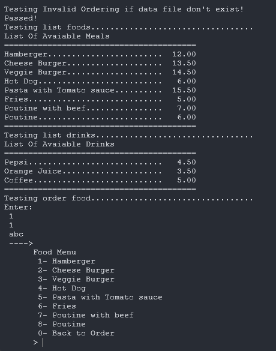

# Food and Drink Ordering System - OOP244 Final Project
---

## Overview

This project implements a **console-based food and drink ordering system** using **Object-Oriented Programming in C++**.  
It simulates a menu-driven ordering interface with food and drink customization, billing, and file-saving functionality.

### Features:
- View and order food/drinks with dynamic menu selections.
- Customize food (e.g., child/adult portion, instructions).
- Select drink sizes (S, M, L, XL) with price scaling.
- Print and save tax-inclusive bills to file.
- Fully modular design using abstract base classes and polymorphism.

---

## Modules

### 1. `Billable` (Abstract Base Class)
- Stores common attributes: `m_name`, `m_price`.
- Declares pure virtual methods:
  - `print()`
  - `order()`
  - `ordered()`
  - `read()`
- Operator overloading: `+` and `+=` for price accumulation.

---

### 2. `Food` (Derived Class)
- Inherits from `Billable`.
- Attributes:
  - `m_ordered`, `m_child`, `m_customize` (dynamic).
- Special features:
  - Child portion is 50% of the adult price.
  - Accepts custom instructions via `std::getline`.
  - Implements Rule of Three.

---

### 3. `Drink` (Derived Class)
- Inherits from `Billable`.
- Attribute: `m_size` (char).
- Price adjustment based on size:
  - `S` = 0.5x, `M` = 0.75x, `L` = 1.0x, `X` = 1.5x.

---

### 4. `Menu` and `MenuItem`
- Dynamically manages hierarchical menu entries.
- Supports:
  - Titles
  - Exit options
  - Indented submenus (up to 3 levels).
- Input validation through `Utils`.

---

### 5. `Ordering`
- Manages the full ordering lifecycle:
  - Load items from files.
  - Handle food/drink order logic.
  - Store ordered items as `Billable*`.
  - Print/save bills with totals and tax.
- Auto-increments bill number and generates unique filenames.

---

### 6. `Utils`
- Safe string operations (`alocpy`, `strcpy`).
- Foolproof input handling:
  - Trims spaces.
  - Validates integers with exception safety.
- Generates bill filenames (`bill_001.txt`, etc).

---

## Object-Oriented Design

| Concept            | Application Example                                                  |
|--------------------|----------------------------------------------------------------------|
| **Encapsulation**  | All members are private, access via methods.                         |
| **Inheritance**    | `Food` and `Drink` inherit `Billable`.                               |
| **Polymorphism**   | `Billable* m_billItems[]` holds any billable object.                 |
| **Dynamic Memory** | Custom instructions and menu items are dynamically allocated.        |
| **Rule of Three**  | Proper copy constructor, assignment, and destructor in key classes.  |

---

## Strengths

-  Modular and extensible design.
-  Input validation and memory safety.
-  Proper abstraction using interfaces.
-  Professional code formatting and documentation.
-  Dynamic menu and file integration.

---

## Conclusion

This project effectively demonstrates advanced C++ OOP principles including polymorphism, abstraction, and modular design.  
This project provides a real-world simulation of an ordering system with clean and maintainable architecture.

---

